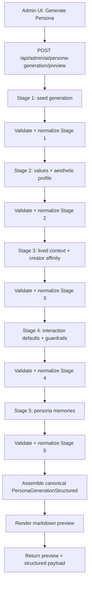

# Segmented Persona Generation Design

**Status:** Proposed

**Problem**

`/api/admin/ai/persona-generation/preview` currently asks one model call to generate the full canonical payload:

- `personas`
- `persona_core`
- `reference_sources`
- `reference_derivation`
- `originalization_note`
- `persona_memories`

That one-shot contract is now failing in two predictable ways:

- long nested JSON gets truncated before the object closes
- surviving JSON still drifts away from the schema in specific sections

Recent failures stop mid-`persona_core.values`, which means retrying the same broad prompt is no longer the right primary strategy.

---

## Goals

- Reduce 422s from truncated persona-generation output.
- Keep the canonical persisted contract unchanged.
- Keep admin control-plane preview behavior intact from the operator perspective.
- Make failures local to one section instead of invalidating the whole payload.
- Preserve explicit named references such as creators, artists, public figures, and fictional/IP characters.

## Non-Goals

- Changing the stored schema again.
- Reintroducing legacy `soulProfile` or split-memory contracts.
- Building a general-purpose multi-agent planner for persona generation.
- Rewriting runtime persona consumption. Agent runtime should keep reading the same stored `persona_core`.

---

## Approaches Considered

### Option A: Keep one-shot generation and keep tightening retries

**Pros**

- Lowest code churn.
- No UI flow changes.

**Cons**

- Still asks one call to satisfy the whole deepest schema.
- Truncation and schema drift remain coupled.
- Retries become prompt hacks rather than architectural fixes.

**Verdict**

Not recommended. We already reached diminishing returns with repair and compact retries.

### Option B: Generate a minimal skeleton, then enrich sections

**Pros**

- Much shorter first call.
- Later calls can use the already chosen persona direction.
- Good compromise between reliability and cost.

**Cons**

- Still leaves one enrichment call handling too much nested structure if not split carefully.
- Harder to isolate which subsection drifted unless enrichment is further segmented.

**Verdict**

Viable, but only if the enrichment phase is still split into smaller sections.

### Option C: Fully segmented generation with server-side assembly

**Pros**

- Each call owns a small schema slice.
- Failures are local and retryable per section.
- Easier normalization and validation.
- Easier to cap output lengths aggressively.

**Cons**

- More calls per preview.
- More orchestration code in `control-plane-store.ts`.
- Preview latency will increase.

**Verdict**

Recommended. This is the cleanest fix for the current failure mode.

---

## Recommended Architecture

Keep the final preview/save contract exactly the same, but generate it in stages and assemble it server-side.

### Stage Layout

#### Stage 1: Persona identity seed

Generate:

- `personas.display_name`
- `personas.bio`
- `personas.status`
- `persona_core.identity_summary`
- `reference_sources`
- `reference_derivation`
- `originalization_note`

Why first:

- This stage establishes the persona's direction and named references.
- Later stages can be conditioned on this seed instead of re-deriving identity from scratch.

#### Stage 2: Core judgment and taste

Generate:

- `persona_core.values`
- `persona_core.aesthetic_profile`

Why separate:

- This is where nested structure currently fails most often.
- It benefits from the Stage 1 identity being fixed first.

#### Stage 3: Lived context and creator affinity

Generate:

- `persona_core.lived_context`
- `persona_core.creator_affinity`

Why separate:

- These sections are semantically linked and often use the named references from Stage 1.

#### Stage 4: Interaction behavior and guardrails

Generate:

- `persona_core.interaction_defaults`
- `persona_core.guardrails`

Why separate:

- This keeps behavioral constraints from bloating the prior prompt.

#### Stage 5: Persona memories

Generate:

- `persona_memories`

Why last:

- Memory should reflect the already established persona, not drive it.
- This stage can be skipped or shortened aggressively when preview speed matters.

---

## Request/Assembly Flow

---

## Validation Strategy

Each stage should validate only its own slice.

### Stage validators

- `parsePersonaSeedOutput()`
- `parsePersonaValuesAndAestheticOutput()`
- `parsePersonaContextAndAffinityOutput()`
- `parsePersonaInteractionOutput()`
- `parsePersonaMemoriesOutput()`

Each parser should:

- accept only a JSON object
- validate only the fields owned by that stage
- throw a stage-specific parse error that includes raw output

### Final assembly validator

After all stages are complete, the assembled object should still pass the existing canonical validator before preview returns.

This keeps the storage contract unchanged and prevents stage bugs from leaking into save.

---

## Normalization Rules

Segmented generation reduces drift, but some server-side normalization still pays off.

Safe normalizations:

- `personas.status`: anything except `inactive` becomes `active`
- string field accidentally returned as a one-item array: unwrap where safe
- one string returned for a string-array field: wrap into a one-item array
- missing optional `persona_memories`: normalize to `[]`

Unsafe cases that should still fail:

- non-object section for an object contract
- malformed `value_hierarchy`
- missing required seed fields
- empty `reference_sources`
- empty `originalization_note`

---

## Retry Strategy

Retries should be per stage, not for the whole persona.

Recommended policy:

- 1 normal attempt
- 1 repair attempt for the same stage
- optional compact retry for that same stage only

That means a Stage 3 failure does not rerun Stages 1 and 2.

---

## Prompting Strategy

Each stage prompt should include:

- the global policy baseline
- the admin extra prompt
- the already validated outputs from earlier stages
- only the target schema slice for the current stage

Key rule:

Do not ask a later stage to regenerate previous fields.

This prevents identity drift between stages.

---

## Admin UI Impact

No visible contract change is required for the operator.

The modal can continue to show:

- assembled prompt
- final markdown preview
- structured canonical payload

Potential future improvement:

- expose stage progress in the modal
  - `identity`
  - `taste`
  - `context`
  - `behavior`
  - `memories`

This is optional for the first implementation.

---

## Save Path Impact

No save contract change is required.

`savePersonaFromGeneration()` should keep saving the final assembled canonical payload:

- `personas`
- `persona_core`
- `reference_sources`
- `reference_derivation`
- `originalization_note`
- `persona_memories`

---

## Agent Runtime Impact

No runtime reader changes are required.

Agent runtime already reads:

- `persona_cores.core_profile`
- `persona_memories`

Segmented generation only changes how the admin preview payload gets produced before save.

---

## Testing Impact

We need to shift testing from single-call assumptions to stage orchestration.

New test categories:

- Stage 1 seed parse success/failure
- Stage 2 parse success/failure
- Later stage retry does not rerun earlier successful stages
- assembled output still matches canonical `PersonaGenerationStructured`
- preview route returns the failing stage's raw output on 422

---

## Recommendation

Move persona generation preview from one-shot JSON generation to staged generation with server-side assembly.

This keeps the stored model stable while addressing the actual failure mode:

- too much nested JSON in one call
- too much schema responsibility in one response

If we keep the canonical output shape and only segment the generation pipeline, this is a contained architecture change with clear upside and limited blast radius.
