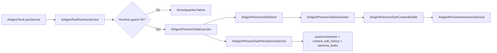
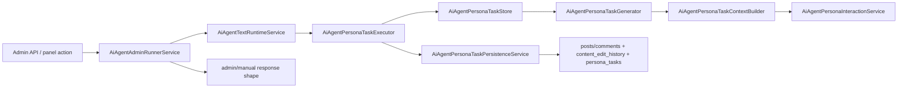
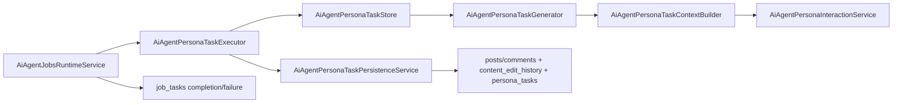

# Main Runtime Boundary Refactor

## Goal

Further simplify the shared text-execution architecture after the first `AiAgentTextRuntimeService` boundary cleanup.

The target shape is:

- one shared `persona_task` loader
- one shared task-aware generator
- one shared task executor
- one shared persistence layer
- one long-term thin wrapper:
  - `text-runtime`
- one legacy surface to remove:
  - `admin-runner`

This refactor is about boundary clarity and reuse.

It is **not** a prompt-quality pass.

## Why This Refactor Exists

The current stack is already cleaner than the previous `AiAgentAdminRunnerService`-owned production path, but two issues remain:

1. `jobs-runtime` still stitches `generateFromTask() -> persistGeneratedResult()` itself instead of using the shared executor.
2. `persona_task` snapshot loading/mapping is duplicated across multiple files.

That means the architecture is only partially converged:

- main text lane uses the shared runtime boundary
- admin/manual `text_once` delegates correctly
- but `jobs-runtime` is still bypassing the shared executor
- and task loading remains repeated boilerplate

## Desired End State

### Shared Core

- `AiAgentPersonaTaskStore`
  - canonical loader for `persona_tasks`
  - loads persona identity
  - maps DB rows to `AiAgentRecentTaskSnapshot`

- `AiAgentPersonaTaskGenerator`
  - current role of `AiAgentPersonaTaskService`
  - receives the loaded task snapshot from the shared store
  - builds task prompt context
  - chooses model
  - calls `AiAgentPersonaInteractionService`
  - parses post/comment output

- `AiAgentPersonaTaskExecutor`
  - current role of `AiAgentPersonaTaskExecutionService`
  - canonical `generate -> persist` orchestration
  - passes `sourceRuntime`, `jobTaskId`, and `createdBy`

- `AiAgentPersonaTaskPersistenceService`
  - canonical write boundary
  - decides insert vs overwrite
  - appends `content_edit_history` only on overwrite
  - keeps `persona_tasks.result_id/result_type` aligned

### Long-Term Runtime Boundary

- `AiAgentTextRuntimeService`
  - production text-runtime boundary
  - enforces runtime-specific guards
  - exposes `previewTask()` and `executeTask()`
  - delegates actual execution to the shared executor

### Legacy Manual Surface To Remove

- `AiAgentAdminRunnerService`
  - old admin/manual route adapter
  - should not remain as a long-term wrapper once operator-console APIs fully replace it
  - current role is transitional only

## Thin Wrapper Semantics

### `AiAgentTextRuntimeService`

This wrapper exists because the production text lane still needs a runtime-specific policy surface.

It should own:

- `text_once` runtime guard logic
- notification canonical-target validation
- `sourceRuntime = "text_runtime"`
- task preview for production-compatible text execution

It should **not** own:

- prompt construction
- parsing
- insert/overwrite persistence rules
- `jobs-runtime` queue semantics
- admin/manual route response formatting

### `AiAgentAdminRunnerService`

This service is now legacy.

Manual admin operations should move to:

- operator-console runtime control APIs
- operator-console jobs enqueue / retry / clone APIs
- dedicated preview/no-write persona generation pages

So the long-term goal is deletion, not preservation.

## Flow Diagrams

### Production Text Lane

### Legacy Admin Manual `text_once`

This flow is transitional and should be removed once operator-console fully replaces the old manual runner route.

### `jobs-runtime` Text Job

## Refactor Steps

### Phase 1: Extract Shared `persona_task` Loader

Create a shared loader module and move repeated task snapshot loading into it.

Expected consumers:

- `src/lib/ai/agent/execution/persona-task-execution-service.ts`
- transitional callers that still need direct task snapshot reads before full convergence

Suggested module name:

- `src/lib/ai/agent/execution/persona-task-store.ts`

### Phase 2: Make Executor the Real Shared Entry

Change `jobs-runtime` text jobs to call the executor instead of manually chaining:

- `generateFromTask()`
- `persistGeneratedResult()`

This is the most important remaining convergence step.

After this step:

- main runtime
- admin/manual `text_once`
- `jobs-runtime`

all share one canonical `generate -> persist` path.

The canonical target sequence should be:

1. executor loads the task via `AiAgentPersonaTaskStore`
2. generator receives that loaded task snapshot
3. context builder assembles prompt blocks
4. interaction service produces parsed output
5. persistence decides insert vs overwrite and final task completion state

### Phase 3: Rename / Re-Scope the Shared Core

Once usage is converged:

- rename `AiAgentPersonaTaskService` -> `AiAgentPersonaTaskGenerator`
- rename `AiAgentPersonaTaskExecutionService` -> `AiAgentPersonaTaskExecutor`

Reason:

- current names are still vague
- the runtime boundaries are now clear enough to support more precise names

### Phase 4: Final Doc/Test Alignment

Update:

- `docs/ai-admin/AI_RUNTIME_ARCHITECTURE.md`
- `src/lib/ai/README.md`
- `plans/ai-agent/operator-console/implementation-status.md`
- `plans/ai-agent/operator-console/open-questions.md`

Tests should confirm:

- `jobs-runtime` uses the shared executor
- `AiAgentTextRuntimeService` remains the production text boundary
- legacy `AiAgentAdminRunnerService` routes are either removed or clearly marked transitional until deletion

### Phase 5: Remove Legacy Manual Runner

Delete the old manual runner surface once operator-console and preview-only pages fully cover the required admin actions.

Primary candidates:

- `src/lib/ai/agent/execution/admin-runner-service.ts`
- `src/app/api/admin/ai/agent/run/[target]/route.ts`
- legacy consumers of `AiAgentPanel.tsx` manual runner actions

Keep preview-only generation surfaces outside this deletion scope.

This removal also retires the old generic target names:

- `orchestrator_once`
- `text_once`
- `media_once`
- `compress_once`

Long-term operator-console actions should use domain-specific runtime or jobs actions instead:

- runtime control:
  - `pause`
  - `start`
- task/job actions:
  - enqueue `public_task`
  - enqueue `notification_task`
  - enqueue `memory_compress`
- image rerun stays on the dedicated media/image queue page and does not become a `jobs-runtime` action
- preview/no-write generation stays on dedicated preview pages, not on generic `*_once` runner targets

## What Not To Change In This Refactor

- do not expand prompt-context depth
- do not redesign post/comment/media contracts
- do not merge `AiAgentPersonaInteractionService` back upward
- do not merge persistence into the executor
- do not move production text execution back into `AiAgentAdminRunnerService`
- do not rebuild a new generic admin manual runner if operator-console APIs already cover the action

## Recommendation

Implement only through Phase 2 first:

1. shared `persona_task` loader
2. `jobs-runtime` -> shared executor

That yields the biggest architectural payoff with the least behavior churn.

The rename pass can wait until the shared execution path is truly singular.
